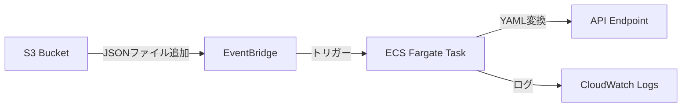

# S3 to API Converter

このプロジェクトは、S3バケットに配置されたJSONファイルを監視し、自動的にYAML形式に変換してAPI エンドポイントに送信するAWSインフラストラクチャを構築します。

## アーキテクチャ



## 作成されるAWSリソース

### ECS関連
1. **ECSクラスター** (`aws_ecs_cluster`)
   - 名前: json-to-yaml-converter
   - Container Insightsが有効化

2. **ECSタスク定義** (`aws_ecs_task_definition`)
   - Fargate互換
   - ネットワークモード: awsvpc
   - CPU: 256 units (デフォルト)
   - メモリ: 512 MB (デフォルト)
   - コンテナ定義:
     - 環境変数: S3_BUCKET, API_ENDPOINT
     - CloudWatchログの設定

### IAMロールとポリシー
1. **ECSタスク実行ロール** (`aws_iam_role.ecs_task_execution`)
   - 名前: json-to-yaml-converter-execution
   - 権限: AmazonECSTaskExecutionRolePolicy

2. **ECSタスクロール** (`aws_iam_role.ecs_task`)
   - 名前: json-to-yaml-converter-task
   - S3アクセス権限:
     - GetObject
     - ListBucket
     - PutObject
     - DeleteObject

3. **EventBridgeスケジューラーロール** (`aws_iam_role.scheduler`)
   - 名前: json-to-yaml-converter-scheduler
   - ECS実行権限:
     - RunTask
     - ListTasks
     - DescribeTasks
   - EventBridge権限:
     - PutTargets
     - PutRule
     - DescribeRule

### EventBridge関連
1. **EventBridgeルール** (`aws_cloudwatch_event_rule`)
   - 名前: capture-s3-put
   - トリガー: S3オブジェクト作成イベント
   - 監視対象: 指定されたS3バケット

2. **EventBridgeターゲット** (`aws_cloudwatch_event_target`)
   - ECS Fargateタスクの起動設定
   - ネットワーク設定:
     - サブネット指定
     - セキュリティグループ適用
     - パブリックIP自動割当

### CloudWatch関連
1. **CloudWatchロググループ** (`aws_cloudwatch_log_group`)
   - 名前: /ecs/json-to-yaml-converter
   - ログ保持期間: 7日

### ネットワーク関連
1. **セキュリティグループ** (`aws_security_group`)
   - 名前: json-to-yaml-converter-task
   - アウトバウンドルール: すべてのトラフィックを許可

## 前提条件

- AWS CLI
- Terraform 1.0以上
- AWS アカウントとアクセス権限

## セットアップ

1. 必要な変数を設定

```hcl
# terraform.tfvars
s3_bucket_name  = "your-bucket-name"
api_endpoint    = "https://your-api-endpoint"
vpc_id         = "vpc-xxxxxxxx"
subnet_ids     = ["subnet-xxxxxxxx", "subnet-yyyyyyyy"]
container_image = "your-container-image-uri"
```

2. Terraformの初期化と適用

```bash
terraform init
terraform plan
terraform apply
```

## 設定パラメータ

| パラメータ名 | 説明 | デフォルト値 |
|------------|------|------------|
| s3_bucket_name | 監視対象のS3バケット名 | 必須 |
| api_endpoint | 変換後のデータを送信するAPIエンドポイント | https://httpbin.org/put |
| vpc_id | タスクを実行するVPC ID | 必須 |
| subnet_ids | タスクを実行するサブネットIDのリスト | 必須 |
| container_image | コンテナイメージURI | 必須 |
| task_cpu | タスクのCPUユニット | 256 |
| task_memory | タスクのメモリ (MB) | 512 |

## 動作の流れ

1. S3バケットに新しいJSONファイルがアップロードされる
2. EventBridgeがファイル作成イベントを検知
3. ECS Fargateタスクが起動
4. Pythonスクリプトが:
   - S3からJSONファイルを読み込み
   - YAML形式に変換
   - 指定されたAPIエンドポイントにデータを送信
   - 処理済みファイルを`processed/`フォルダに移動
5. 処理結果がCloudWatchログに記録

## ログの確認

CloudWatchロググループで以下のログを確認できます：
- ECSタスク実行ログ: `/ecs/json-to-yaml-converter`

## 注意事項

- APIエンドポイントは外部からアクセス可能である必要があります
- S3バケットに大量のファイルが同時にアップロードされた場合、タスクが並列実行される可能性があります
- 処理済みファイルは自動的に`processed/`フォルダに移動されます
