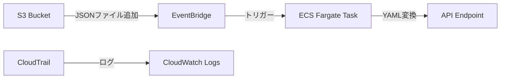

# S3 to API Converter

このプロジェクトは、S3バケットに配置されたJSONファイルを監視し、自動的にYAML形式に変換してAPI エンドポイントに送信するAWSインフラストラクチャを構築します。

## アーキテクチャ



## 主な機能

- S3バケットの監視とイベント検知
- JSONからYAMLへの自動変換
- ECS Fargateを使用したサーバーレス実行
- APIエンドポイントへのデータ送信
- CloudWatchによるログ管理
- 処理済みファイルの自動アーカイブ

## 前提条件

- AWS CLI
- Terraform 1.0以上
- AWS アカウントとアクセス権限

## セットアップ

1. 必要な変数を設定

```hcl
# terraform.tfvars
s3_bucket_name         = "your-bucket-name"
api_endpoint           = "https://your-api-endpoint"
vpc_id                 = "vpc-xxxxxxxx"
subnet_ids             = ["subnet-xxxxxxxx", "subnet-yyyyyyyy"]
cloudtrail_bucket_name = "your-cloudtrail-bucket"
container_image        = "your-container-image-uri"
```

2. Terraformの初期化と適用

```bash
terraform init
terraform plan
terraform apply
```

## 設定パラメータ

| パラメータ名 | 説明 | デフォルト値 |
|------------|------|------------|
| s3_bucket_name | 監視対象のS3バケット名 | 必須 |
| api_endpoint | 変換後のデータを送信するAPIエンドポイント | https://httpbin.org/put |
| vpc_id | タスクを実行するVPC ID | 必須 |
| subnet_ids | タスクを実行するサブネットIDのリスト | 必須 |
| cloudtrail_bucket_name | CloudTrailログ用のS3バケット名 | 必須 |
| container_image | コンテナイメージURI | 必須 |
| task_cpu | タスクのCPUユニット | 256 |
| task_memory | タスクのメモリ (MB) | 512 |

## 動作の流れ

1. S3バケットに新しいJSONファイルがアップロードされる
2. EventBridgeがファイル作成イベントを検知
3. ECS Fargateタスクが起動
4. Pythonスクリプトが:
   - S3からJSONファイルを読み込み
   - YAML形式に変換
   - 指定されたAPIエンドポイントにデータを送信
   - 処理済みファイルを`processed/`フォルダに移動
5. 処理結果がCloudWatchログに記録

## ログの確認

CloudWatchロググループで以下のログを確認できます：
- ECSタスク実行ログ: `/ecs/json-to-yaml-converter`
- S3イベントログ: `/aws/cloudtrail/s3-events`

## セキュリティ

- ECSタスク実行用のIAMロール
- S3アクセス用のIAMポリシー
- CloudTrail用のIAMロール
- セキュリティグループによるネットワーク制御

## 注意事項

- APIエンドポイントは外部からアクセス可能である必要があります
- S3バケットに大量のファイルが同時にアップロードされた場合、タスクが並列実行される可能性があります
- 処理済みファイルは自動的に`processed/`フォルダに移動されます
